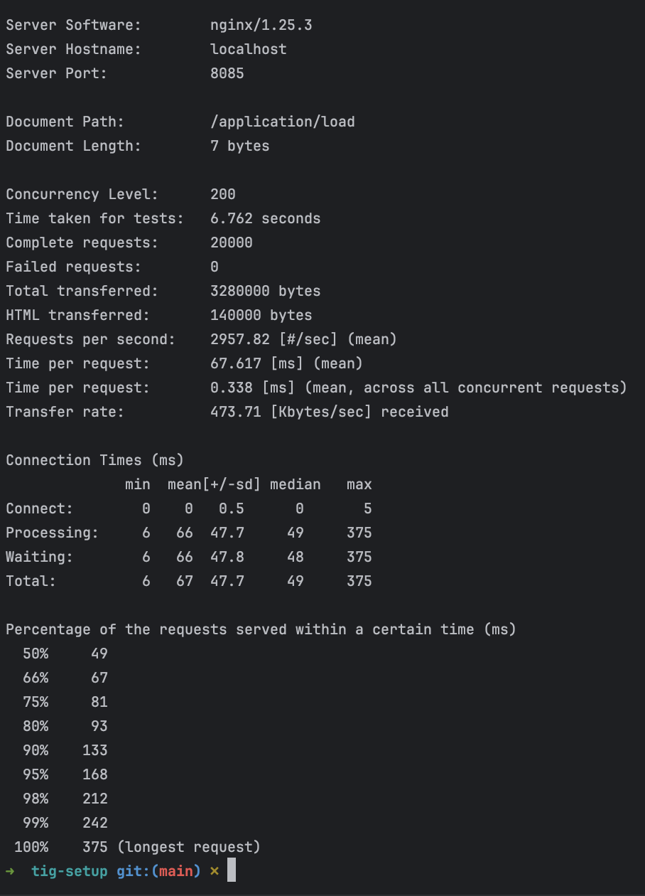
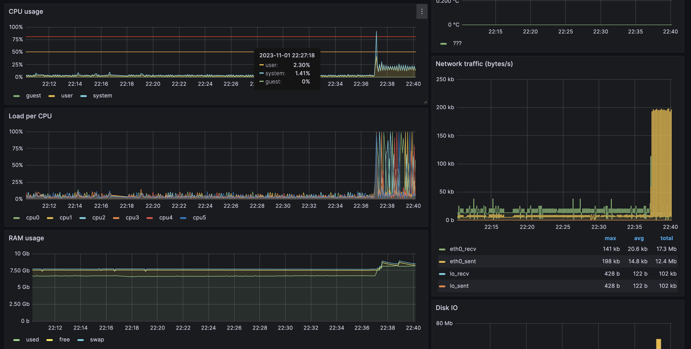
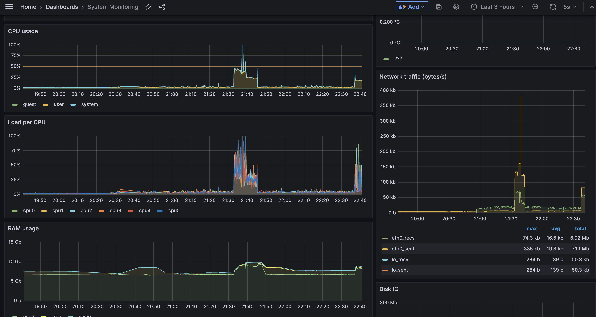

# tig-setup
Repository that holds example of local setup for TIG stack in docker compose

## Setup

1) Run local setup
```bash
docker compose up -d
```

2) Visit http://localhost:8085 to go to grafana and setup password
3) Visit http://localhost:8085/d/NceaJU3ik/system-monitoring?orgId=1&refresh=5s for system metrics
4) Run load testing script
```bash
docker run --rm --network host httpd ab -c 200 -n 15000 http://localhost:8085/application/load
```

5) Wait for couple mins and you should see some system load on a dashboard



5) Cleanup infra
```bash
docker compose down -v
```